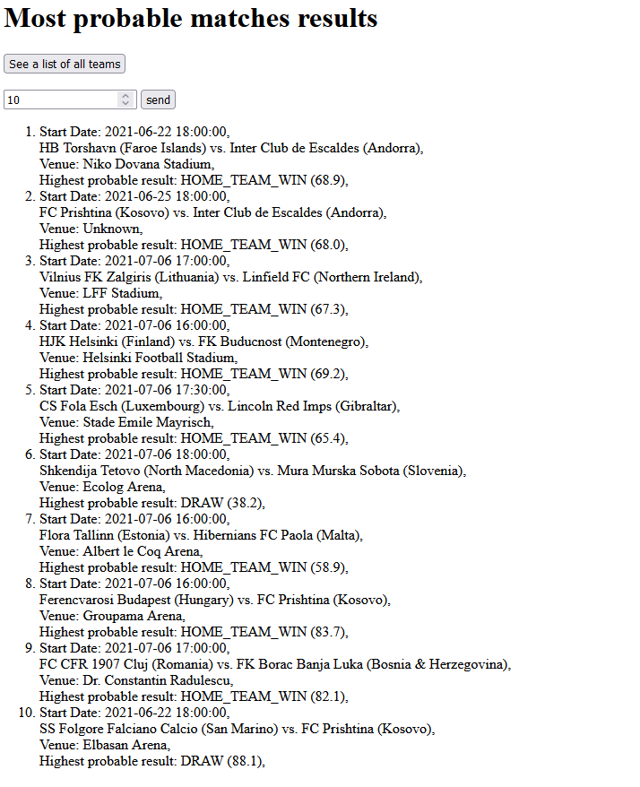

# Football-Matches-Results
This is app which displays the most probable results of matches read from json file

## How to run it:
Just clone and build it with your IDE, then run it and go to web browser: http://localhost:8080/matches

## Notes
Unfortunately I was not able to finish the feature with returning as many events as it was given in the parameter (it has to be done in the future). This led to the fact that I also didn't do any validation of this parameter but I am checking if venue is a null and the types of data for win rates (there was a venue which was null and some of rates are long type while most of them are double). On the other hand I tried to use Spring framework and I exposed two endpoints for that app. One of them is returning the ten matches results and the second one displays a list of all teams sorted alphabetically. 
## Screenshot
  
